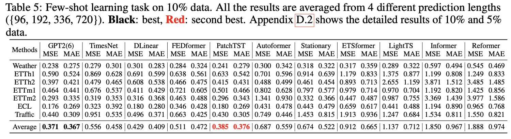

# One Fits All: Power General Time Series Analysis by Pretrained LM (NeurIPS 2023 Spotlight)

Tian Zhou, Peisong Niu, Xue Wang, Liang Sun, Rong Jin, "One Fits All: Power General Time Series Analysis by Pretrained LM,", NeurIPS, 2023. [[paper](https://arxiv.org/abs/2302.11939)]

## Few-shot Learning



## Get Start

- Install Python>=3.8, PyTorch 1.8.1.
- Download data. You can obtain all the benchmarks from [[TimesNet](https://github.com/thuml/Time-Series-Library)].
- For electricity and traffic datasets with a batch size of 2048, we utilize 4 V100 GPUs, while for other datasets, we use a single V100 GPU.
- Train the model. We provide the experiment scripts of all benchmarks under the folder `./scripts`. You can reproduce the experiment results by:

```bash
bash ./scripts/ETTh1.sh
bash ./scripts/ETTh2.sh
```

## Citation

If you find this repo useful, please cite our paper. 

```
@inproceedings{zhou2023onefitsall,
  title={{One Fits All}: Power General Time Series Analysis by Pretrained LM},
  author={Tian Zhou, Peisong Niu, Xue Wang, Liang Sun, Rong Jin},
  booktitle={NeurIPS},
  year={2023}
}
```